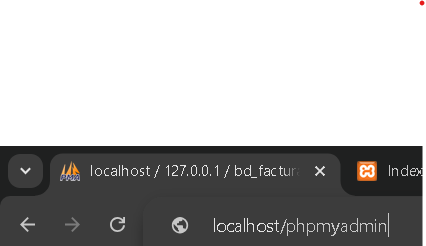

# 📘 Guía para Principiantes: Cómo Crear Reportes en PHP Paso a Paso

Bienvenido a esta guía completa donde te enseñaremos cómo crear reportes en **PHP**. Esta guía está pensada para principiantes que **no tienen experiencia previa**, por lo que explicaremos **todo desde cero**, paso a paso.

## 🌐 Parte 2: Crear Reportes en PHP con phpMyAdmin

### ✅ ¿Qué necesitas?

- Instalar XAMPP o WAMP.
```
https://www.apachefriends.org/es/index.html
```

- Acceder a **phpMyAdmin**.


- Crear archivos `.php`.


> ### 🧱 Paso 1: Crear la base de datos en phpMyAdmin

1. Abre tu navegador y escribe `localhost/phpmyadmin`.



2. Crea una base de datos llamada `BD_FacturacionPruebas`.

```sql
CREATE TABLE factura (
    id INT AUTO_INCREMENT PRIMARY KEY,
    descripcion VARCHAR(255),
    categoria VARCHAR(100),
    cantidad INT,
    precio_unitario DECIMAL(10,2),
    itebis DECIMAL(10,2),
    descuento DECIMAL(10,2),
    total_general DECIMAL(10,2)
);
```


> ### 🧱 Paso 2: Crear los archivos en una carpeta

Crea una carpeta llamada `facturas` dentro de `htdocs`, y agrega estos archivos:

```
htdocs/
└── facturas/
    ├── conexion.php
    ├── guardar_factura.php
    ├── reporte_facturas.php
    ├── imprimir_pdf.php
    ├── editar.php
    ├── eliminar.php
    ├── formulario.php
    ├── actualizar.php
    ├── estilos.css
```


> ### 🧱 Paso 3: Conexión en PHP (conexion.php)

```php
<?php
$conexion = new mysqli("localhost", "root", "", "BD_FacturacionPruebas");

if ($conexion->connect_error) {
    die("Conexión fallida: " . $conexion->connect_error);
}
?>

```


> ### 🧱 Paso 4: Mostrar el reporte (reporte_facturas.php)

```php
<?php
include 'conexion.php';

$resultado = $conexion->query("SELECT * FROM factura");
?>

<!DOCTYPE html>
<html>
<head>
    <title>Reporte de Facturas</title>
    <link rel="stylesheet" href="estilos.css">
</head>
<body>
    <h2>Reporte de Facturas</h2>
    <table border="1">
        <tr>
            <th>ID</th>
            <th>DESCRIPCIÓN</th>
            <th>CATEGORÍA</th>
            <th>CANTIDAD</th>
            <th>PRECIO UNITARIO</th>
            <th>ITEBIS</th>
            <th>DESCUENTO</th>
            <th>TOTAL GENERAL</th>
            <th>ACCIONES</th>
        </tr>
        <?php while($fila = $resultado->fetch_assoc()): ?>
        <tr>
            <td><?= $fila['ID'] ?></td>
            <td><?= $fila['DESCRIPCION'] ?></td>
            <td><?= $fila['CATEGORIA'] ?></td>
            <td><?= $fila['CANTIDAD'] ?></td>   
            <td><?= number_format($fila['PRECIO_UNITARIO'], 2) ?></td>
            <td><?= number_format($fila['ITEBIS'], 2) ?></td>
            <td><?= number_format($fila['DESCUENTO'], 2) ?></td>
            <td><?= number_format($fila['TOTAL_GENERAL'], 2) ?></td>
            <td><a href="imprimir_pdf.php?id=<?= $fila['ID'] ?>" target="_blank">Imprimir PDF</a>| <a href="editar.php?id=<?= $fila['ID'] ?>">Editar</a> |
            <a href="eliminar.php?id=<?= $fila['ID'] ?>" onclick="return confirm('¿Estás seguro de eliminar esta factura?')">Eliminar</a></td>
            
        </tr>
        <?php endwhile; ?>
    </table>
</body>
</html>

```


> ### 🧱 Paso 5: Imprimir reporte en PDF (imprimir_pdf.php)

1. Descarga la librería TCPDF desde [tcpdf.org](https://sourceforge.net/projects/tcpdf/).
2. Crea el archivo con este código:

```php
<?php
require_once('tcpdf/tcpdf.php');
include 'conexion.php';

// Obtener ID de la factura desde GET
$id = isset($_GET['id']) ? intval($_GET['id']) : 0;

// Consultar datos de la factura
$sql = "SELECT * FROM factura WHERE id = $id";
$resultado = $conexion->query($sql);
$fila = $resultado->fetch_assoc();

if (!$fila) {
    die("Factura no encontrada");
}

// Crear PDF
$pdf = new TCPDF();
$pdf->AddPage();
$pdf->SetFont('helvetica', '', 12);

// Contenido de la factura
$html = '
<h2>Factura N.º ' . $fila['ID'] . '</h2>
<table border="1" cellpadding="5">
<tr><td><b>Descripción</b></td><td>' . $fila['DESCRIPCION'] . '</td></tr>
<tr><td><b>Categoría</b></td><td>' . $fila['CATEGORIA'] . '</td></tr>
<tr><td><b>Cantidad</b></td><td>' . $fila['CANTIDAD'] . '</td></tr>
<tr><td><b>Precio Unitario</b></td><td>' . number_format($fila['PRECIO_UNITARIO'], 2) . '</td></tr>
<tr><td><b>ITEBIS</b></td><td>' . number_format($fila['ITEBIS'], 2) . '</td></tr>
<tr><td><b>Descuento</b></td><td>' . number_format($fila['DESCUENTO'], 2) . '</td></tr>
<tr><td><b>Total General</b></td><td><b>' . number_format($fila['TOTAL_GENERAL'], 2) . '</b></td></tr>
</table>
';

$pdf->writeHTML($html, true, false, true, false, '');

// Descargar PDF
$pdf->Output('factura_' . $fila['ID'] . '.pdf', 'I');
?>

```

***🧰 REQUISITOS PREVIOS***

**1. Tener instalado:**
Un servidor web local como XAMPP o Laragon, que incluye:

    PHP

    Apache

    MySQL


**2. Descargar la librería TCPDF:**
Ir a la web oficial: https://tcpdf.org o directamente en GitHub: https://github.com/tecnickcom/TCPDF

- Descargar el ZIP y extraerlo dentro de tu proyecto.

- Asegúrate de tener una carpeta llamada tcpdf/ dentro de tu proyecto.

***🛠️ PASO A PASO DEL CÓDIGO***

```php
require_once('tcpdf/tcpdf.php');
```

- Esto incluye la librería TCPDF. Es obligatorio para poder usar sus funciones.


```php
include 'conexion.php';
```

- Incluye el archivo donde tienes la conexión a la base de datos. Este archivo debe tener algo como esto:

```php
<?php
$conexion = new mysqli("localhost", "root", "", "BD_FacturacionPruebas");
if ($conexion->connect_error) {
    die("Error de conexión: " . $conexion->connect_error);
}
?>
```

```php
$id = isset($_GET['id']) ? intval($_GET['id']) : 0;
```

- Captura el ID de la factura que vendrá por la URL.
Ejemplo: **generar_pdf.php?id=5**


```php
$sql = "SELECT * FROM factura WHERE id = $id";
$resultado = $conexion->query($sql);
$fila = $resultado->fetch_assoc();
```
- Consulta los datos de la factura con ese ID.
**$fila** tendrá todos los datos: descripción, categoría, cantidad, etc.

```php
if (!$fila) {
    die("Factura no encontrada");
}
```
- Si no existe una factura con ese ID, muestra un error.


***📄 Creación del PDF***
```php
$pdf = new TCPDF();
$pdf->AddPage();
$pdf->SetFont('helvetica', '', 12);
```
- Crea el archivo PDF, añade una página y define la fuente del texto.

***🧾 Contenido HTML de la factura***
```php
$html = '
<h2>Factura N.º ' . $fila['ID'] . '</h2>
<table border="1" cellpadding="5">
...
</table>';
```

- Crea una tabla en HTML con los datos de la factura.
Esto es muy cómodo porque TCPDF permite usar HTML para diseñar el contenido del PDF.


***📥 Mostrar o descargar el PDF***
```php

$pdf->writeHTML($html, true, false, true, false, '');
$pdf->Output('factura_' . $fila['ID'] . '.pdf', 'I');
```

- **writeHTML(...):** convierte el HTML en contenido PDF.

- **Output(...):** genera y muestra el PDF en el navegador.
Si cambiaras **I** por **D**, el navegador lo descargaría automáticamente.


***✅ CÓMO PROBARLO***
Coloca este archivo como generar_pdf.php.

Asegúrate de tener una tabla factura en tu base de datos BD_FacturacionPruebas con los campos:

- ID

- DESCRIPCION

- CATEGORIA

- CANTIDAD

- PRECIO_UNITARIO

- ITEBIS

- DESCUENTO

- TOTAL_GENERAL

**Accede a la URL:**

```bash
http://localhost/mi_proyecto/generar_pdf.php?id=1
```


***📝 CONSEJO***

Asegúrate de que los nombres de las columnas en la base de datos están escritos igual que en el código. Si usas mayúsculas, mantenlas. Si cambias nombres (por ejemplo, **descripcion** en vez de **DESCRIPCION**), también cambia el código.


> ### 🧱 Paso 6: Guardar Factura (guardar_factura.php)

```php
<?php
include 'conexion.php';

$descripcion = $_POST['descripcion'];
$categoria = $_POST['categoria'];
$cantidad = $_POST['cantidad'];
$precio_unitario = $_POST['precio_unitario'];
$itebis = $_POST['itebis'];
$descuento = $_POST['descuento'];

$total_general = ($cantidad * $precio_unitario + $itebis) - $descuento;

$sql = "INSERT INTO factura (descripcion, categoria, cantidad, precio_unitario, itebis, descuento, total_general)
        VALUES ('$descripcion', '$categoria', $cantidad, $precio_unitario, $itebis, $descuento, $total_general)";

if ($conexion->query($sql) === TRUE) {
    echo "Factura guardada correctamente.";
    echo "<br><a href='reporte_facturas.php'>Ver Reporte</a>";
} else {
    echo "Error: " . $sql . "<br>" . $conexion->error;
}
?>
```


> ### 🧱 Paso 7: Editar Reportes (editar.php)
```php
<?php
include 'conexion.php';

$id = $_GET['id'] ?? 0;
$sql = "SELECT * FROM factura WHERE id = $id";
$resultado = $conexion->query($sql);
$fila = $resultado->fetch_assoc();

if (!$fila) {
    die("Factura no encontrada");
}
?>
```
<!DOCTYPE html>
<html>
<head>
    <title>Editar Factura</title>
    <link rel="stylesheet" href="estilos.css">
</head>
<body>
<h2>Editar Factura</h2>
<form action="actualizar.php" method="POST">
    <input type="hidden" name="id" value="<?= $fila['ID'] ?>">
    
    <label>Descripción:</label>
    <input type="text" name="descripcion" value="<?= $fila['DESCRIPCION'] ?>" required><br>
    
    <label>Categoría:</label>
    <input type="text" name="categoria" value="<?= $fila['CATEGORIA'] ?>" required><br>
    
    <label>Cantidad:</label>
    <input type="number" name="cantidad" value="<?= $fila['CANTIDAD'] ?>" required><br>
    
    <label>Precio Unitario:</label>
    <input type="number" step="0.01" name="precio_unitario" value="<?= $fila['PRECIO_UNITARIO'] ?>" required><br>
    
    <label>ITEBIS:</label>
    <input type="number" step="0.01" name="itebis" value="<?= $fila['ITEBIS'] ?>" required><br>
    
    <label>Descuento:</label>
    <input type="number" step="0.01" name="descuento" value="<?= $fila['DESCUENTO'] ?>" required><br>
    
    <label>Total General:</label>
    <input type="number" step="0.01" name="total_general" value="<?= $fila['TOTAL_GENERAL'] ?>" required><br>

    <button type="submit">Actualizar</button>
</form>
</body>
</html>

```


> ### 🧱 Paso 8: Eliminar Reportes (eliminar.php)
```php
<?php
include 'conexion.php';

$id = $_GET['id'] ?? 0;

$sql = "DELETE FROM factura WHERE id = $id";
if ($conexion->query($sql)) {
    header("Location: reporte_facturas.php");
} else {
    echo "Error al eliminar: " . $conexion->error;
}
?>

```

> ### 🧱 Paso 9: Formulario (formulario.php)
```php
<!DOCTYPE html>
<html>
<head>
    <title>Formulario Factura</title>
    <link rel="stylesheet" href="estilos.css">
</head>
<body>
    <h2>Registro de Factura</h2>
    <form action="guardar_factura.php" method="POST">
        <input type="text" name="descripcion" placeholder="Descripción" required><br>
        <input type="text" name="categoria" placeholder="Categoría" required><br>
        <input type="number" name="cantidad" placeholder="Cantidad" required><br>
        <input type="number" step="0.01" name="precio_unitario" placeholder="Precio Unitario" required><br>
        <input type="number" step="0.01" name="itebis" placeholder="ITEBIS" required><br>
        <input type="number" step="0.01" name="descuento" placeholder="Descuento" required><br>
        <button type="submit">Guardar</button>
    </form>
</body>
</html>
```


> ### 🧱 Paso 10: Actualizar (actualizar_pdf.php)

```php
<?php
include 'conexion.php';

$id = $_POST['id'];
$descripcion = $_POST['descripcion'];
$categoria = $_POST['categoria'];
$cantidad = $_POST['cantidad'];
$precio_unitario = $_POST['precio_unitario'];
$itebis = $_POST['itebis'];
$descuento = $_POST['descuento'];
$total_general = $_POST['total_general'];

$sql = "UPDATE factura SET 
    DESCRIPCION='$descripcion',
    CATEGORIA='$categoria',
    cantidad=$cantidad,
    precio_unitario=$precio_unitario,
    itebis=$itebis,
    descuento=$descuento,
    total_general=$total_general
    WHERE id=$id";

if ($conexion->query($sql)) {
    header("Location: reporte_facturas.php");
} else {
    echo "Error al actualizar: " . $conn->error;
}
?>
```
---

## 🧠 ¿Por qué es útil aprender esto?

- Puedes generar facturas para tu empresa o negocio.
- Te permite imprimir o guardar reportes profesionales.
- Aprendes a conectar aplicaciones con bases de datos reales.
- Puedes ofrecer este servicio como programador.

---

¡Listo! Ya sabes cómo crear reportes en **PHP con phpMyAdmin**, aunque seas principiante.

