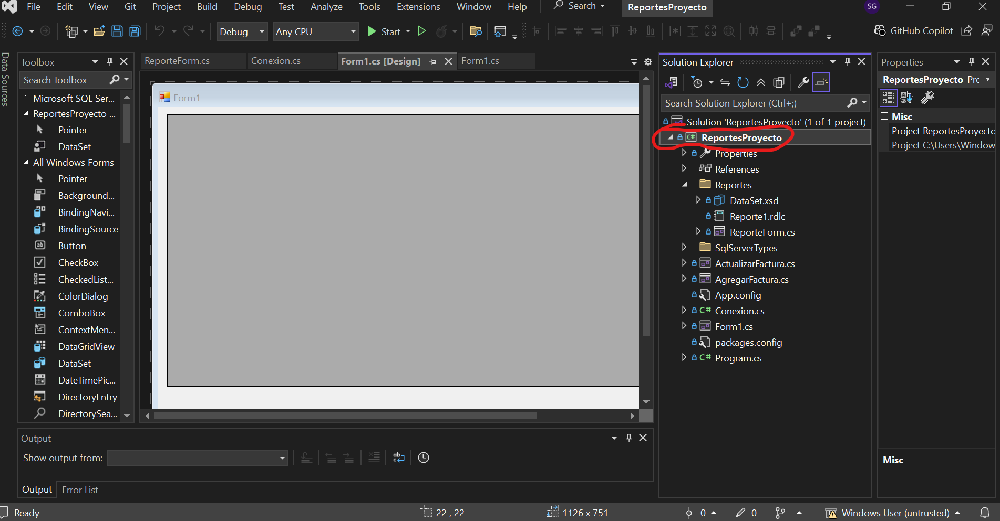
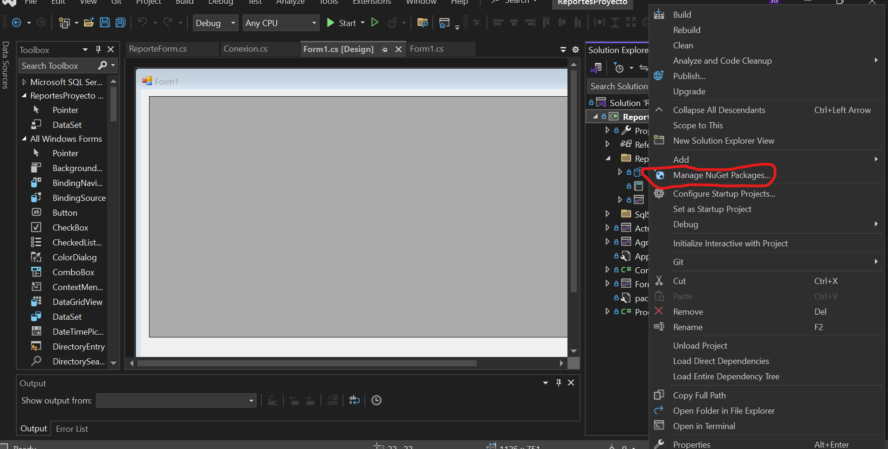
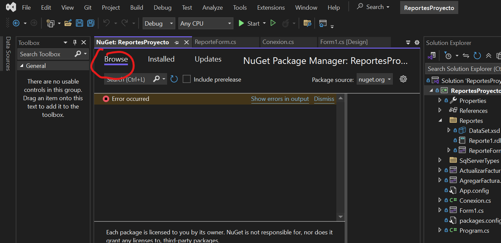
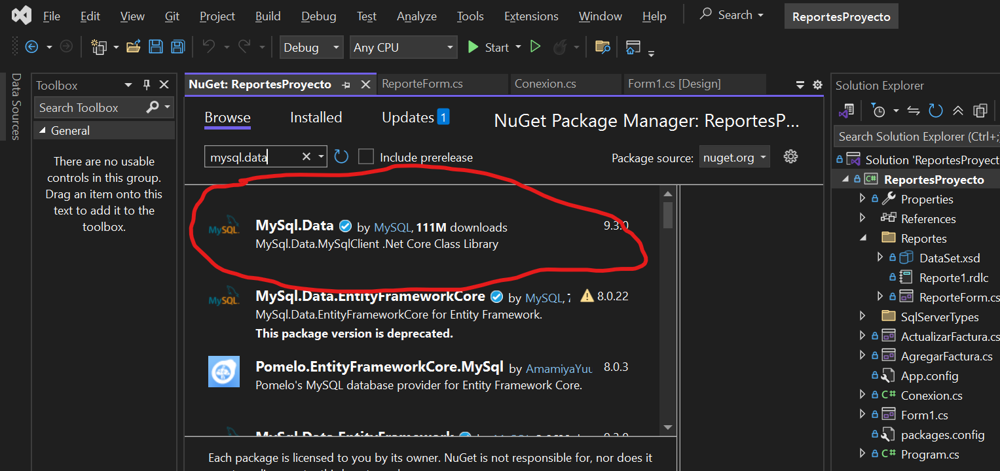

# 📘 Guía para Principiantes: Cómo Crear Reportes en C# Paso a Paso

Bienvenido a esta guía completa donde te enseñaremos cómo crear reportes en **C#**. Esta guía está pensada para principiantes que **no tienen experiencia previa**, por lo que explicaremos **todo desde cero**, paso a paso.
Un **reporte** es un documento que nos muestra datos organizados, como los detalles de una **factura**, los **productos vendidos**, los **clientes atendidos**, etc. Sirve para mostrar, imprimir o guardar información importante de forma clara y ordenada.

---

## 🧩 Parte 1: Crear Reportes en C# con SQL Server

### ✅ ¿Qué necesitas?

- Visual Studio instalado.
- SQL Server Management Studio (SSMS).
- Conocimientos básicos de cómo crear un formulario en Windows Forms.
- Entity Framework.
- Componente `ReportViewer`.

### 🧱 Paso 1: Crear la base de datos

Abre SQL Server Management Studio y ejecuta este código:

```sql
CREATE DATABASE BD_FacturacionPruebas;

USE BD_FacturacionPruebas;

CREATE TABLE Factura (
    ID INT PRIMARY KEY IDENTITY,
    Descripcion VARCHAR(100),
    Categoria VARCHAR(50),
    Cantidad INT,
    Precio_Unitario DECIMAL(10,2),
    ITEBIS DECIMAL(10,2),
    Descuento DECIMAL(10,2),
    Total_General DECIMAL(10,2)
);
```

### 🧱 Paso 2: Crear el proyecto en Visual Studio

1. Abre Visual Studio.
2. Crea un proyecto tipo **Windows Forms App (.NET Framework)**.
3. Agrega Entity Framework desde NuGet:
   - Haz clic derecho en el proyecto → **Administrar paquetes NuGet**.
   - Busca **EntityFramework** e instálalo.

### 🧱 Paso 3: Agregar la conexión a la base de datos

1. Agrega un archivo `App.config` (si no lo tienes).
2. Coloca esta línea dentro de `<configuration>`:

```xml
<connectionStrings>
  <add name="conexion" connectionString="Data Source=.;Initial Catalog=BD_FacturacionPruebas;Integrated Security=True" providerName="System.Data.SqlClient" />
</connectionStrings>
```

### 🧱 Paso 4: Crear un Modelo de Datos

1. Agrega una clase llamada `Factura`.
2. Define las propiedades que coincidan con las columnas de la tabla.

```csharp
public class Factura
{
    public int ID { get; set; }
    public string Descripcion { get; set; }
    public string Categoria { get; set; }
    public int Cantidad { get; set; }
    public decimal Precio_Unitario { get; set; }
    public decimal ITEBIS { get; set; }
    public decimal Descuento { get; set; }
    public decimal Total_General { get; set; }
}
```

3. Agrega una clase de contexto `FacturaContext`:

```csharp
using System.Data.Entity;

public class FacturaContext : DbContext
{
    public FacturaContext() : base("name=conexion") { }
    public DbSet<Factura> Facturas { get; set; }
}
```

### 🧱 Paso 5: Crear el Reporte

1. Haz clic derecho en el proyecto → **Agregar → Nuevo elemento → Reporte (.rdlc)**.
2. Diseña una tabla con los campos de la factura.
3. Agrega un formulario y un componente **ReportViewer** desde la caja de herramientas.
4. En el código del formulario, carga los datos:

```csharp
FacturaContext db = new FacturaContext();
var lista = db.Facturas.ToList();
ReportDataSource rds = new ReportDataSource("DataSet1", lista);
reportViewer1.LocalReport.DataSources.Clear();
reportViewer1.LocalReport.DataSources.Add(rds);
reportViewer1.RefreshReport();
```
# 📘 Documentación para Proyecto de Reportes en C#

Esta guía está diseñada para principiantes que desean aprender cómo crear un sistema de facturación con generación de reportes en PDF utilizando C#, SQL Server y ReportViewer.

---

## 📁 Estructura del Proyecto

Asegúrate de que tu solución tenga la siguiente estructura de carpetas y archivos:

```
ReportesProyecto/
├── Properties/
├── Referencias/
├── Reportes/
│   ├── DataSet.xsd
│   ├── Reporte1.rdlc
│   └── ReporteForm.cs
├── SqlServerTypes/
├── ActualizarFactura.cs
├── AgregarFactura.cs
├── App.config
├── Conexion.cs
├── Form1.cs
├── packages.config
└── Program.cs
```

---

## 🧱 Paso 1: Crear la conexión a la base de datos (Conexion.cs)

Este archivo permite que el proyecto se comunique con SQL Server.

📍**Ubicación del código:** Archivo `Conexion.cs`

```csharp
using System;
using System.Collections.Generic;
using System.Linq;
using System.Text;
using System.Threading.Tasks;
using System.Data.SqlClient;
using System.Data;

namespace ReportesProyecto
{
    public class Conexion
    {

        private static string stringConnection = "Data Source=AARONCS;Initial Catalog=BD_FacturacionPruebas;Integrated Security=True;";

        public static void AgregarFactura(string Descripcion, string Categoria, int Cantidad, decimal Precio_Unitario, decimal Itebis, decimal Descuento, decimal Total_General)
        {
            using (SqlConnection conn = new SqlConnection(stringConnection))
            {
                conn.Open();
   
                SqlCommand cmd = new SqlCommand("INSERT INTO Facturas(Descripcion, Categoria, Cantidad, Precio_Unitario, Itebis, Descuento, Total_General) " +
                    "VALUES (@Descripcion, @Categoria, @Cantidad, @Precio_Unitario, @Itebis, @Descuento, @Total_General)", conn);

                cmd.Parameters.AddWithValue("@Descripcion", Descripcion);
                cmd.Parameters.AddWithValue("@Categoria", Categoria);
                cmd.Parameters.AddWithValue("@Cantidad", Cantidad);
                cmd.Parameters.AddWithValue("@Precio_Unitario", Precio_Unitario);
                cmd.Parameters.AddWithValue("@Itebis", Itebis);
                cmd.Parameters.AddWithValue("@Descuento", Descuento);
                cmd.Parameters.AddWithValue("@Total_General", Total_General);

                cmd.ExecuteNonQuery();
            }
        }

        public static void Eliminar(int id)
        {
            using (SqlConnection conn = new SqlConnection(stringConnection))
            {
                conn.Open();

                SqlCommand cmd = new SqlCommand("DELETE FROM Facturas WHERE ID = @id", conn);
                cmd.Parameters.AddWithValue("@id", id);
                cmd.ExecuteNonQuery();
            }
        }

        public static void ActualizarFactura(int id, string Descripcion, string Categoria, int Cantidad, decimal Precio_Unitario, decimal Itebis, decimal Descuento, decimal Total_General)
        {
            using (SqlConnection conn = new SqlConnection(stringConnection))
            {
                conn.Open();

                SqlCommand cmd = new SqlCommand("UPDATE Facturas SET Descripcion = @Descripcion, Categoria = @Categoria, Cantidad = @Cantidad, " +
                    "Precio_Unitario = @Precio_Unitario, Itebis = @Itebis, Descuento = @Descuento, Total_General = @Total_General WHERE ID = @id", conn);

                cmd.Parameters.AddWithValue("@id", id);
                cmd.Parameters.AddWithValue("@Descripcion", Descripcion);
                cmd.Parameters.AddWithValue("@Categoria", Categoria);
                cmd.Parameters.AddWithValue("@Cantidad", Cantidad);
                cmd.Parameters.AddWithValue("@Precio_Unitario", Precio_Unitario);
                cmd.Parameters.AddWithValue("@Itebis", Itebis);
                cmd.Parameters.AddWithValue("@Descuento", Descuento);
                cmd.Parameters.AddWithValue("@Total_General", Total_General);

                cmd.ExecuteNonQuery();
            }
        }

        public static DataSet LeerFacturas()
        {
            using (SqlConnection conn = new SqlConnection(stringConnection))
            {
                conn.Open();

                SqlCommand cmd = new SqlCommand("SELECT * FROM Facturas", conn);

                SqlDataAdapter adapter = new SqlDataAdapter(cmd);
                DataSet ds = new DataSet();
                adapter.Fill(ds);

                return ds;
            }
        }
    }
}

```

---

## 🧾 Paso 2: Crear formulario para insertar facturas (AgregarFactura.cs)

Este formulario contendrá campos como descripción, cantidad, precio, ITBIS, descuento y total.

📍**Ubicación del código:** Archivo `AgregarFactura.cs`

```csharp
using System;
using System.Collections.Generic;
using System.ComponentModel;
using System.Data;
using System.Drawing;
using System.Linq;
using System.Text;
using System.Threading.Tasks;
using System.Windows.Forms;

namespace ReportesProyecto
{
    public partial class AgregarFactura : Form
    {
        public AgregarFactura()
        {
            InitializeComponent();
        }

        private void agregarBtn_Click(object sender, EventArgs e)
        {
            string descripcion = descripcionBox.Text.Trim();
            string categoria = categoriaBox.Text.Trim();
            string cantidadText = cantidadBox.Text.Trim();
            string precioUnitarioText = precioUnitarioBox.Text.Trim();
            string itbisText = itbisBox.Text.Trim();
            string descuentoText = descuentoBox.Text.Trim();
            string totalGeneralText = totalGeneralBox.Text.Trim();

            if (string.IsNullOrEmpty(descripcion) || string.IsNullOrEmpty(categoria) ||
                string.IsNullOrEmpty(cantidadText) || string.IsNullOrEmpty(precioUnitarioText) ||
                string.IsNullOrEmpty(itbisText) || string.IsNullOrEmpty(descuentoText) ||
                string.IsNullOrEmpty(totalGeneralText))
            {
                MessageBox.Show("Todos los campos son obligatorios.", "Advertencia", MessageBoxButtons.OK, MessageBoxIcon.Warning);
                return;
            }

            if (!int.TryParse(cantidadText, out int cantidad))
            {
                MessageBox.Show("La cantidad debe ser un número entero válido.", "Error", MessageBoxButtons.OK, MessageBoxIcon.Error);
                return;
            }

            if (!decimal.TryParse(precioUnitarioText, out decimal precioUnitario))
            {
                MessageBox.Show("El precio unitario debe ser un número decimal válido.", "Error", MessageBoxButtons.OK, MessageBoxIcon.Error);
                return;
            }

            if (!decimal.TryParse(itbisText, out decimal itbis))
            {
                MessageBox.Show("El ITBIS debe ser un número decimal válido.", "Error", MessageBoxButtons.OK, MessageBoxIcon.Error);
                return;
            }

            if (!decimal.TryParse(descuentoText, out decimal descuento))
            {
                MessageBox.Show("El descuento debe ser un número decimal válido.", "Error", MessageBoxButtons.OK, MessageBoxIcon.Error);
                return;
            }

            if (!decimal.TryParse(totalGeneralText, out decimal totalGeneral))
            {
                MessageBox.Show("El total general debe ser un número decimal válido.", "Error", MessageBoxButtons.OK, MessageBoxIcon.Error);
                return;
            }

            try
            {
                Conexion.AgregarFactura(descripcion, categoria, cantidad, precioUnitario, itbis, descuento, totalGeneral);
                MessageBox.Show("Factura agregada correctamente.", "Éxito", MessageBoxButtons.OK, MessageBoxIcon.Information);
            }
            catch (Exception ex)
            {
                MessageBox.Show($"Ocurrió un error al agregar la factura: {ex.Message}", "Error", MessageBoxButtons.OK, MessageBoxIcon.Error);
            }
        }
    }
}

```

Este formulario debe tener dos botones: `Guardar Factura` y `Registro`.

---

## 📝 Paso 3: Crear formulario principal (Form1.cs)

Este formulario debe tener botones para:

- Insertar Factura
- Editar Factura
- Eliminar Factura
- Imprimir Factura

📍**Ubicación del código:** Archivo `Form1.cs`

```csharp
using ReportesProyecto.Reportes;
using System;
using System.Windows.Forms;

namespace ReportesProyecto
{
    public partial class Form1 : Form
    {
        public Form1()
        {
            InitializeComponent();
        }

        private void RefreshData()
        {
            dataGridView1.DataSource = Conexion.LeerFacturas();
        }

        private void Form1_Load(object sender, EventArgs e)
        {
            RefreshData();
        }

        private void agregarBtn_Click(object sender, EventArgs e)
        {
            AgregarFactura form = new AgregarFactura();
            form.ShowDialog();
            RefreshData();
        }

        private void actualizarBtn_Click(object sender, EventArgs e)
        {
            if (dataGridView1.SelectedRows.Count == 0)
            {
                MessageBox.Show("Por favor seleccione una fila.", "Advertencia", MessageBoxButtons.OK, MessageBoxIcon.Warning);
                return;
            }

            var selectedRow = dataGridView1.SelectedRows[0];

            try
            {

                int id = Convert.ToInt32(selectedRow.Cells["ID"].Value?.ToString().Trim());
                string descripcion = selectedRow.Cells["Descripcion"].Value?.ToString().Trim();
                string categoria = selectedRow.Cells["Categoria"].Value?.ToString().Trim();
                int cantidad = Convert.ToInt32(selectedRow.Cells["Cantidad"].Value);
                decimal precioUnitario = Convert.ToDecimal(selectedRow.Cells["Precio_Unitario"].Value);
                decimal itbis = Convert.ToDecimal(selectedRow.Cells["Itebis"].Value);
                decimal descuento = Convert.ToDecimal(selectedRow.Cells["Descuento"].Value);
                decimal totalGeneral = Convert.ToDecimal(selectedRow.Cells["Total_General"].Value);

                ActualizarFactura detalleForm = new ActualizarFactura(id, descripcion, categoria, cantidad, precioUnitario, itbis, descuento, totalGeneral);
                detalleForm.ShowDialog();
                RefreshData();
            }
            catch (Exception ex)
            {
                MessageBox.Show($"Error al obtener los datos de la fila seleccionada: {ex.Message}", "Error", MessageBoxButtons.OK, MessageBoxIcon.Error);
            }
        }

        private void eliminarBtn_Click(object sender, EventArgs e)
        {
            if (dataGridView1.SelectedRows.Count == 0)
            {
                MessageBox.Show("Por favor seleccione una fila.", "Advertencia", MessageBoxButtons.OK, MessageBoxIcon.Warning);
                return;
            }

            var selectedRow = dataGridView1.SelectedRows[0];

            try
            {
                int id = Convert.ToInt32(selectedRow.Cells["ID"].Value?.ToString());
                Conexion.Eliminar(id);
                RefreshData();
            }catch(Exception ex)
            {
                MessageBox.Show($"Error al obtener el identificador de la fila seleccionada: {ex.Message}", "Error", MessageBoxButtons.OK, MessageBoxIcon.Error);
            }
        }

        private void reporteBtn_Click(object sender, EventArgs e)
        {
            ReporteForm form = new ReporteForm();
            form.ShowDialog();
        }
    }
}

```

---

## 🛠️ Paso 4: Crear el formulario para actualizar facturas (ActualizarFactura.cs)

Permite editar los datos de una factura existente.

📍**Ubicación del código:** Archivo `ActualizarFactura.cs`

```csharp
using System;
using System.Collections.Generic;
using System.ComponentModel;
using System.Data;
using System.Drawing;
using System.Linq;
using System.Text;
using System.Threading.Tasks;
using System.Windows.Forms;

namespace ReportesProyecto
{
    public partial class ActualizarFactura : Form
    {
        public int Id;

        public ActualizarFactura(int id, string descripcion, string categoria, int cantidad, decimal precioUnitario, decimal itbis, decimal descuento, decimal totalGeneral)
        {
            InitializeComponent();
            Id = id;
            descripcionBox.Text = descripcion;
            categoriaBox.Text = categoria;
            cantidadBox.Text = cantidad.ToString();
            precioUnitarioBox.Text = precioUnitario.ToString("0.00");
            itbisBox.Text = itbis.ToString("0.00");
            descuentoBox.Text = descuento.ToString("0.00");
            totalGeneralBox.Text = totalGeneral.ToString("0.00");
        }

        private void actualizarBtn_Click(object sender, EventArgs e)
        {
            string descripcion = descripcionBox.Text.Trim();
            string categoria = categoriaBox.Text.Trim();
            string cantidadText = cantidadBox.Text.Trim();
            string precioUnitarioText = precioUnitarioBox.Text.Trim();
            string itbisText = itbisBox.Text.Trim();
            string descuentoText = descuentoBox.Text.Trim();
            string totalGeneralText = totalGeneralBox.Text.Trim();

            if (string.IsNullOrEmpty(descripcion) || string.IsNullOrEmpty(categoria) ||
                string.IsNullOrEmpty(cantidadText) || string.IsNullOrEmpty(precioUnitarioText) ||
                string.IsNullOrEmpty(itbisText) || string.IsNullOrEmpty(descuentoText) ||
                string.IsNullOrEmpty(totalGeneralText))
            {
                MessageBox.Show("Todos los campos son obligatorios.", "Advertencia", MessageBoxButtons.OK, MessageBoxIcon.Warning);
                return;
            }

            if (!int.TryParse(cantidadText, out int cantidad))
            {
                MessageBox.Show("La cantidad debe ser un número entero válido.", "Error", MessageBoxButtons.OK, MessageBoxIcon.Error);
                return;
            }

            if (!decimal.TryParse(precioUnitarioText, out decimal precioUnitario))
            {
                MessageBox.Show("El precio unitario debe ser un número decimal válido.", "Error", MessageBoxButtons.OK, MessageBoxIcon.Error);
                return;
            }

            if (!decimal.TryParse(itbisText, out decimal itbis))
            {
                MessageBox.Show("El ITBIS debe ser un número decimal válido.", "Error", MessageBoxButtons.OK, MessageBoxIcon.Error);
                return;
            }

            if (!decimal.TryParse(descuentoText, out decimal descuento))
            {
                MessageBox.Show("El descuento debe ser un número decimal válido.", "Error", MessageBoxButtons.OK, MessageBoxIcon.Error);
                return;
            }

            if (!decimal.TryParse(totalGeneralText, out decimal totalGeneral))
            {
                MessageBox.Show("El total general debe ser un número decimal válido.", "Error", MessageBoxButtons.OK, MessageBoxIcon.Error);
                return;
            }

            try
            {
                Conexion.ActualizarFactura(Id, descripcion, categoria, cantidad, precioUnitario, itbis, descuento, totalGeneral);
                MessageBox.Show("Factura agregada correctamente.", "Éxito", MessageBoxButtons.OK, MessageBoxIcon.Information);
                Close();
            }
            catch (Exception ex)
            {
                MessageBox.Show($"Ocurrió un error al actualizar la factura: {ex.Message}", "Error", MessageBoxButtons.OK, MessageBoxIcon.Error);
            }
        }
    }
}

```

---

## 📄 Paso 5: Crear el reporte (Reporte1.rdlc y DataSet.xsd)

1. Crea un nuevo archivo `.rdlc` desde la carpeta `Reportes`.
2. Diseña el layout del reporte arrastrando campos desde el `DataSet.xsd`.
3. Asegúrate de que el `DataSet.xsd` esté bien conectado a la base de datos.

📍**Ubicación de diseño visual:** Carpeta `Reportes/`

---

## 🖨️ Paso 6: Crear el formulario que muestra el reporte (ReporteForm.cs)

Este formulario contiene el `ReportViewer`, que permite visualizar y exportar el reporte.

📍**Ubicación del código:** Archivo `ReporteForm.cs`

```csharp
using System;
using System.Collections.Generic;
using System.ComponentModel;
using System.Data;
using System.Drawing;
using System.Linq;
using System.Text;
using System.Threading.Tasks;
using System.Windows.Forms;

namespace ReportesProyecto.Reportes
{
    public partial class ReporteForm : Form
    {
        public ReporteForm()
        {
            InitializeComponent();
        }

        private void ReporteForm_Load(object sender, EventArgs e)
        {

            this.reportViewer1.RefreshReport();
        }
    }
}

```
## ✅ Paso a paso: Instalar MySql.Data (mysqlclient) desde NuGet

**🔹 Paso 1: Abrir el Administrador de NuGet**

**Hay dos formas de hacerlo:**

**Opción A (interfaz gráfica):**

- Haz clic derecho sobre tu proyecto en el Explorador de soluciones.

- Selecciona "Administrar paquetes NuGet...".


**Opción B (línea de comandos):**

Ve a Herramientas > Administrador de paquetes NuGet > Consola del Administrador de paquetes.




---


## Paso 2: Buscar el paquete MySql.Data

**Si usas la interfaz gráfica:**
- En la pestaña "Examinar", escribe:

```csharp
MySql.Data
```
- Selecciona el paquete que diga "MySql.Data" (autor: Oracle).

- Haz clic en Instalar.

**Si usas la consola:**

- Escribe y ejecuta este comando:

```mathematica
Install-Package MySql.Data
```


---

## 🔹 Paso 3: Aceptar los términos
Cuando aparezca la ventana emergente, acepta los términos de licencia para continuar con la instalación.

---
## 🔹 Paso 4: Confirmar instalación
**Una vez instalado, verifica:**

- Que el paquete aparece en la pestaña "Instalado".

- Que en el archivo **.csproj** se agregó una línea similar a:

```xml
<PackageReference Include="MySql.Data" Version="8.x.x" />
```
---

## 🔹 Paso 5: Usar en tu código

**Ya puedes usar MySQL en tu código C#. Ejemplo:**

```csharp
using MySql.Data.MySqlClient
```
---

## ¿Qué hace este código?

Este código crea una ventana (formulario) que puede mostrar reportes. Es parte de una aplicación de escritorio en C# utilizando Windows Forms y el componente llamado `ReportViewer`.

---

## Explicación del Código

```csharp
using System;
using System.Collections.Generic;
using System.ComponentModel;
using System.Data;
using System.Drawing;
using System.Linq;
using System.Text;
using System.Threading.Tasks;
using System.Windows.Forms;
```

- ¿Qué es esto?

Estas líneas están incluyendo librerías o módulos que ya vienen con C#. Estas librerías contienen funcionalidades para manejar ventanas, gráficos, textos, datos, etc.

---


```csharp

namespace ReportesProyecto.Reportes
{
```
- ¿Qué es un namespace?

Es como una carpeta virtual que agrupa clases relacionadas. Aquí, el código está dentro del espacio llamado ReportesProyecto.Reportes.

---
```csharp

public partial class ReporteForm : Form
```

- ¿Qué es una clase?

Una clase es una plantilla que describe cómo será un objeto. En este caso, ReporteForm es una clase que representa una ventana con capacidad de mostrar reportes.

**public:** significa que esta clase se puede usar desde otros archivos.

**partial:** indica que la definición de la clase puede estar dividida en varios archivos.

**Form:** significa que esta clase hereda de Form, lo que quiere decir que es un formulario de Windows.

---

```csharp
    {
        public ReporteForm()
        {
            InitializeComponent();
        }
```
- ¿Qué es esto?

Esto es el constructor de la clase. Es lo primero que se ejecuta cuando se crea un objeto de tipo ReporteForm. Dentro del constructor se llama al método InitializeComponent(), que configura la ventana y sus controles.

---

```csharp
        private void ReporteForm_Load(object sender, EventArgs e)
        {
            this.reportViewer1.RefreshReport();
        }
```

- ¿Qué es ReporteForm_Load?

Es un evento que se ejecuta automáticamente cuando la ventana termina de cargarse. Aquí se usa para actualizar el ReportViewer con el método RefreshReport().

---
## Conclusión ##

Este código crea una ventana que contiene un componente visual llamado ReportViewer, y cuando esa ventana se carga, el componente se actualiza para mostrar el reporte. Es útil en sistemas que necesitan mostrar facturas, informes o gráficos generados desde datos.


---

🔧 **Propiedades importantes del ReportViewer**:
- `LocalReport.ReportPath` debe apuntar a `Reportes/Reporte1.rdlc`
- Se debe conectar al `DataSet` que retorna los datos desde la base

---

## 🏁 Paso Final: Ejecutar el proyecto

Presiona **F5** para compilar y ejecutar. Asegúrate de que la conexión a SQL Server esté funcionando y que el reporte esté correctamente enlazado.

---

## 🧠 Recomendaciones

- Usa nombres claros en tus formularios y campos.
- Valida todos los datos antes de insertarlos.
- Asegúrate de probar cada módulo de forma independiente.

---

*Creado para principiantes por ChatGPT con ayuda del usuario*

- Puedes generar facturas para tu empresa o negocio.
- Te permite imprimir o guardar reportes profesionales.
- Aprendes a conectar aplicaciones con bases de datos reales.
- Puedes ofrecer este servicio como programador.

---

¡Listo! Ya sabes cómo crear reportes en **C#**, aunque seas principiante.
---
---
---
---
---


# php


# 📘 Guía para Principiantes: Cómo Crear Reportes en PHP Paso a Paso

Bienvenido a esta guía completa donde te enseñaremos cómo crear reportes en **PHP**. Esta guía está pensada para principiantes que **no tienen experiencia previa**, por lo que explicaremos **todo desde cero**, paso a paso.

## 🌐 Parte 2: Crear Reportes en PHP con phpMyAdmin

### ✅ ¿Qué necesitas?

- Instalar XAMPP o WAMP.
```
https://www.apachefriends.org/es/index.html
```

- Acceder a **phpMyAdmin**.


- Crear archivos `.php`.


> ### 🧱 Paso 1: Crear la base de datos en phpMyAdmin

1. Abre tu navegador y escribe `localhost/phpmyadmin`.


2. Crea una base de datos llamada `BD_FacturacionPruebas`.

```sql
CREATE TABLE factura (
    id INT AUTO_INCREMENT PRIMARY KEY,
    descripcion VARCHAR(255),
    categoria VARCHAR(100),
    cantidad INT,
    precio_unitario DECIMAL(10,2),
    itebis DECIMAL(10,2),
    descuento DECIMAL(10,2),
    total_general DECIMAL(10,2)
);
```


> ### 🧱 Paso 2: Crear los archivos en una carpeta

Crea una carpeta llamada `facturas` dentro de `htdocs`, y agrega estos archivos:

```
htdocs/
└── facturas/
    ├── conexion.php
    ├── guardar_factura.php
    ├── reporte_facturas.php
    ├── imprimir_pdf.php
    ├── editar.php
    ├── eliminar.php
    ├── formulario.php
    ├── actualizar.php
    ├── estilos.css
```


> ### 🧱 Paso 3: Conexión en PHP (conexion.php)

```php
<?php
$conexion = new mysqli("localhost", "root", "", "BD_FacturacionPruebas");

if ($conexion->connect_error) {
    die("Conexión fallida: " . $conexion->connect_error);
}
?>

```


> ### 🧱 Paso 4: Mostrar el reporte (reporte_facturas.php)

```php
<?php
include 'conexion.php';

$resultado = $conexion->query("SELECT * FROM factura");
?>

<!DOCTYPE html>
<html>
<head>
    <title>Reporte de Facturas</title>
    <link rel="stylesheet" href="estilos.css">
</head>
<body>
    <h2>Reporte de Facturas</h2>
    <table border="1">
        <tr>
            <th>ID</th>
            <th>DESCRIPCIÓN</th>
            <th>CATEGORÍA</th>
            <th>CANTIDAD</th>
            <th>PRECIO UNITARIO</th>
            <th>ITEBIS</th>
            <th>DESCUENTO</th>
            <th>TOTAL GENERAL</th>
            <th>ACCIONES</th>
        </tr>
        <?php while($fila = $resultado->fetch_assoc()): ?>
        <tr>
            <td><?= $fila['ID'] ?></td>
            <td><?= $fila['DESCRIPCION'] ?></td>
            <td><?= $fila['CATEGORIA'] ?></td>
            <td><?= $fila['CANTIDAD'] ?></td>   
            <td><?= number_format($fila['PRECIO_UNITARIO'], 2) ?></td>
            <td><?= number_format($fila['ITEBIS'], 2) ?></td>
            <td><?= number_format($fila['DESCUENTO'], 2) ?></td>
            <td><?= number_format($fila['TOTAL_GENERAL'], 2) ?></td>
            <td><a href="imprimir_pdf.php?id=<?= $fila['ID'] ?>" target="_blank">Imprimir PDF</a>| <a href="editar.php?id=<?= $fila['ID'] ?>">Editar</a> |
            <a href="eliminar.php?id=<?= $fila['ID'] ?>" onclick="return confirm('¿Estás seguro de eliminar esta factura?')">Eliminar</a></td>
            
        </tr>
        <?php endwhile; ?>
    </table>
</body>
</html>

```


> ### 🧱 Paso 5: Imprimir reporte en PDF (imprimir_pdf.php)

1. Descarga la librería TCPDF desde [tcpdf.org](https://sourceforge.net/projects/tcpdf/).
2. Crea el archivo con este código:

```php
<?php
require_once('tcpdf/tcpdf.php');
include 'conexion.php';

// Obtener ID de la factura desde GET
$id = isset($_GET['id']) ? intval($_GET['id']) : 0;

// Consultar datos de la factura
$sql = "SELECT * FROM factura WHERE id = $id";
$resultado = $conexion->query($sql);
$fila = $resultado->fetch_assoc();

if (!$fila) {
    die("Factura no encontrada");
}

// Crear PDF
$pdf = new TCPDF();
$pdf->AddPage();
$pdf->SetFont('helvetica', '', 12);

// Contenido de la factura
$html = '
<h2>Factura N.º ' . $fila['ID'] . '</h2>
<table border="1" cellpadding="5">
<tr><td><b>Descripción</b></td><td>' . $fila['DESCRIPCION'] . '</td></tr>
<tr><td><b>Categoría</b></td><td>' . $fila['CATEGORIA'] . '</td></tr>
<tr><td><b>Cantidad</b></td><td>' . $fila['CANTIDAD'] . '</td></tr>
<tr><td><b>Precio Unitario</b></td><td>' . number_format($fila['PRECIO_UNITARIO'], 2) . '</td></tr>
<tr><td><b>ITEBIS</b></td><td>' . number_format($fila['ITEBIS'], 2) . '</td></tr>
<tr><td><b>Descuento</b></td><td>' . number_format($fila['DESCUENTO'], 2) . '</td></tr>
<tr><td><b>Total General</b></td><td><b>' . number_format($fila['TOTAL_GENERAL'], 2) . '</b></td></tr>
</table>
';

$pdf->writeHTML($html, true, false, true, false, '');

// Descargar PDF
$pdf->Output('factura_' . $fila['ID'] . '.pdf', 'I');
?>

```

***🧰 REQUISITOS PREVIOS***

**1. Tener instalado:**
Un servidor web local como XAMPP o Laragon, que incluye:

    PHP

    Apache

    MySQL


**2. Descargar la librería TCPDF:**
Ir a la web oficial: https://tcpdf.org o directamente en GitHub: https://github.com/tecnickcom/TCPDF

- Descargar el ZIP y extraerlo dentro de tu proyecto.

- Asegúrate de tener una carpeta llamada tcpdf/ dentro de tu proyecto.

***🛠️ PASO A PASO DEL CÓDIGO***

```php
require_once('tcpdf/tcpdf.php');
```

- Esto incluye la librería TCPDF. Es obligatorio para poder usar sus funciones.


```php
include 'conexion.php';
```

- Incluye el archivo donde tienes la conexión a la base de datos. Este archivo debe tener algo como esto:

```php
<?php
$conexion = new mysqli("localhost", "root", "", "BD_FacturacionPruebas");
if ($conexion->connect_error) {
    die("Error de conexión: " . $conexion->connect_error);
}
?>
```

```php
$id = isset($_GET['id']) ? intval($_GET['id']) : 0;
```

- Captura el ID de la factura que vendrá por la URL.
Ejemplo: **generar_pdf.php?id=5**


```php
$sql = "SELECT * FROM factura WHERE id = $id";
$resultado = $conexion->query($sql);
$fila = $resultado->fetch_assoc();
```
- Consulta los datos de la factura con ese ID.
**$fila** tendrá todos los datos: descripción, categoría, cantidad, etc.

```php
if (!$fila) {
    die("Factura no encontrada");
}
```
- Si no existe una factura con ese ID, muestra un error.


***📄 Creación del PDF***
```php
$pdf = new TCPDF();
$pdf->AddPage();
$pdf->SetFont('helvetica', '', 12);
```
- Crea el archivo PDF, añade una página y define la fuente del texto.

***🧾 Contenido HTML de la factura***
```php
$html = '
<h2>Factura N.º ' . $fila['ID'] . '</h2>
<table border="1" cellpadding="5">
...
</table>';
```

- Crea una tabla en HTML con los datos de la factura.
Esto es muy cómodo porque TCPDF permite usar HTML para diseñar el contenido del PDF.


***📥 Mostrar o descargar el PDF***
```php

$pdf->writeHTML($html, true, false, true, false, '');
$pdf->Output('factura_' . $fila['ID'] . '.pdf', 'I');
```

- **writeHTML(...):** convierte el HTML en contenido PDF.

- **Output(...):** genera y muestra el PDF en el navegador.
Si cambiaras **I** por **D**, el navegador lo descargaría automáticamente.


***✅ CÓMO PROBARLO***
Coloca este archivo como generar_pdf.php.

Asegúrate de tener una tabla factura en tu base de datos BD_FacturacionPruebas con los campos:

- ID

- DESCRIPCION

- CATEGORIA

- CANTIDAD

- PRECIO_UNITARIO

- ITEBIS

- DESCUENTO

- TOTAL_GENERAL

**Accede a la URL:**

```bash
http://localhost/mi_proyecto/generar_pdf.php?id=1
```


***📝 CONSEJO***

Asegúrate de que los nombres de las columnas en la base de datos están escritos igual que en el código. Si usas mayúsculas, mantenlas. Si cambias nombres (por ejemplo, **descripcion** en vez de **DESCRIPCION**), también cambia el código.


> ### 🧱 Paso 6: Guardar Factura (guardar_factura.php)

```php
<?php
include 'conexion.php';

$descripcion = $_POST['descripcion'];
$categoria = $_POST['categoria'];
$cantidad = $_POST['cantidad'];
$precio_unitario = $_POST['precio_unitario'];
$itebis = $_POST['itebis'];
$descuento = $_POST['descuento'];

$total_general = ($cantidad * $precio_unitario + $itebis) - $descuento;

$sql = "INSERT INTO factura (descripcion, categoria, cantidad, precio_unitario, itebis, descuento, total_general)
        VALUES ('$descripcion', '$categoria', $cantidad, $precio_unitario, $itebis, $descuento, $total_general)";

if ($conexion->query($sql) === TRUE) {
    echo "Factura guardada correctamente.";
    echo "<br><a href='reporte_facturas.php'>Ver Reporte</a>";
} else {
    echo "Error: " . $sql . "<br>" . $conexion->error;
}
?>
```


> ### 🧱 Paso 7: Editar Reportes (editar.php)
```php
<?php
include 'conexion.php';

$id = $_GET['id'] ?? 0;
$sql = "SELECT * FROM factura WHERE id = $id";
$resultado = $conexion->query($sql);
$fila = $resultado->fetch_assoc();

if (!$fila) {
    die("Factura no encontrada");
}
?>
```
<!DOCTYPE html>
<html>
<head>
    <title>Editar Factura</title>
    <link rel="stylesheet" href="estilos.css">
</head>
<body>
<h2>Editar Factura</h2>
<form action="actualizar.php" method="POST">
    <input type="hidden" name="id" value="<?= $fila['ID'] ?>">
    
    <label>Descripción:</label>
    <input type="text" name="descripcion" value="<?= $fila['DESCRIPCION'] ?>" required><br>
    
    <label>Categoría:</label>
    <input type="text" name="categoria" value="<?= $fila['CATEGORIA'] ?>" required><br>
    
    <label>Cantidad:</label>
    <input type="number" name="cantidad" value="<?= $fila['CANTIDAD'] ?>" required><br>
    
    <label>Precio Unitario:</label>
    <input type="number" step="0.01" name="precio_unitario" value="<?= $fila['PRECIO_UNITARIO'] ?>" required><br>
    
    <label>ITEBIS:</label>
    <input type="number" step="0.01" name="itebis" value="<?= $fila['ITEBIS'] ?>" required><br>
    
    <label>Descuento:</label>
    <input type="number" step="0.01" name="descuento" value="<?= $fila['DESCUENTO'] ?>" required><br>
    
    <label>Total General:</label>
    <input type="number" step="0.01" name="total_general" value="<?= $fila['TOTAL_GENERAL'] ?>" required><br>

    <button type="submit">Actualizar</button>
</form>
</body>
</html>

```


> ### 🧱 Paso 8: Eliminar Reportes (eliminar.php)
```php
<?php
include 'conexion.php';

$id = $_GET['id'] ?? 0;

$sql = "DELETE FROM factura WHERE id = $id";
if ($conexion->query($sql)) {
    header("Location: reporte_facturas.php");
} else {
    echo "Error al eliminar: " . $conexion->error;
}
?>

```

> ### 🧱 Paso 9: Formulario (formulario.php)
```php
<!DOCTYPE html>
<html>
<head>
    <title>Formulario Factura</title>
    <link rel="stylesheet" href="estilos.css">
</head>
<body>
    <h2>Registro de Factura</h2>
    <form action="guardar_factura.php" method="POST">
        <input type="text" name="descripcion" placeholder="Descripción" required><br>
        <input type="text" name="categoria" placeholder="Categoría" required><br>
        <input type="number" name="cantidad" placeholder="Cantidad" required><br>
        <input type="number" step="0.01" name="precio_unitario" placeholder="Precio Unitario" required><br>
        <input type="number" step="0.01" name="itebis" placeholder="ITEBIS" required><br>
        <input type="number" step="0.01" name="descuento" placeholder="Descuento" required><br>
        <button type="submit">Guardar</button>
    </form>
</body>
</html>
```


> ### 🧱 Paso 10: Actualizar (actualizar_pdf.php)

```php
<?php
include 'conexion.php';

$id = $_POST['id'];
$descripcion = $_POST['descripcion'];
$categoria = $_POST['categoria'];
$cantidad = $_POST['cantidad'];
$precio_unitario = $_POST['precio_unitario'];
$itebis = $_POST['itebis'];
$descuento = $_POST['descuento'];
$total_general = $_POST['total_general'];

$sql = "UPDATE factura SET 
    DESCRIPCION='$descripcion',
    CATEGORIA='$categoria',
    cantidad=$cantidad,
    precio_unitario=$precio_unitario,
    itebis=$itebis,
    descuento=$descuento,
    total_general=$total_general
    WHERE id=$id";

if ($conexion->query($sql)) {
    header("Location: reporte_facturas.php");
} else {
    echo "Error al actualizar: " . $conn->error;
}
?>
```
---

## 🧠 ¿Por qué es útil aprender esto?

- Puedes generar facturas para tu empresa o negocio.
- Te permite imprimir o guardar reportes profesionales.
- Aprendes a conectar aplicaciones con bases de datos reales.
- Puedes ofrecer este servicio como programador.

---

¡Listo! Ya sabes cómo crear reportes en **PHP con phpMyAdmin**, aunque seas principiante.


